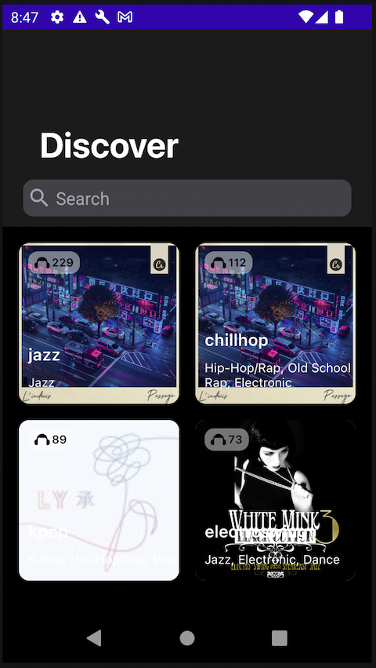
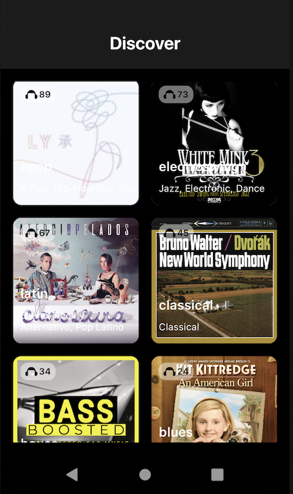

Jetpack Sample [work in progress]
==================

This repo demonstrates how we can use jetpack compose to build an app for showing a list and filtering the list with search feature.
Master branch uses Uni Directional Data Flow. There is a Non-UDDF branch which helps you to see how using UDDF makes the code more readable and cleaner.
I have also implemented a collapsing app bar that you can get idea about how you can animate view elements in compose.

## Technologies & Patterns

* Ktor for network request
* Koin for dependency injection
* Clean architecture, meaning using data, UI and domain layers
* Jetpack compose for building UI
* Kotlin coroutines
* Kotlin flows
* Paging API
* Uni Directional Data Flow

## Features

* Showing the list with pagination
* Searching when user starts typing 
* Collapsing toolbar in jetpack

## Screenshots

 
 